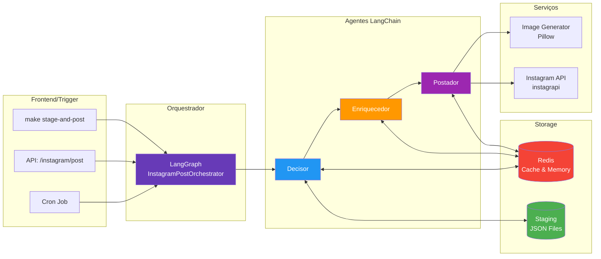
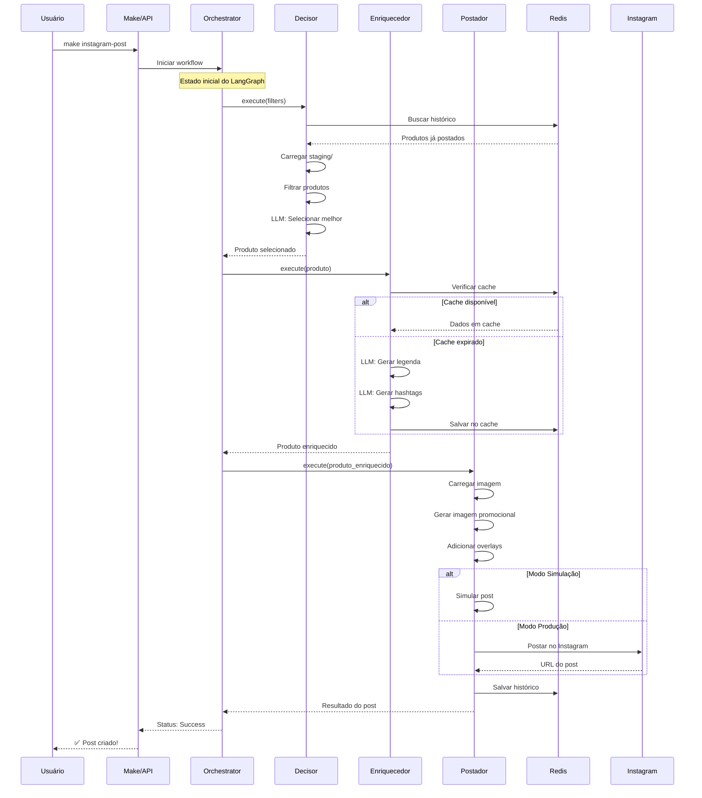
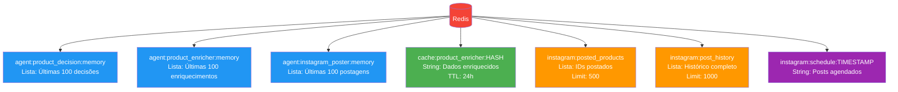
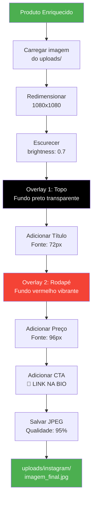

```mermaid
graph TB
    Start([Trigger: make stage-and-post]) --> CheckStaging{Produtos<br/>no Staging?}
    
    CheckStaging -->|Sim| Orchestrator[Instagram Post Orchestrator<br/>LangGraph]
    CheckStaging -->|Não| NoProducts[❌ Nenhum produto<br/>disponível]
    
    Orchestrator --> Agent1[🎯 Agente 1: Decisor<br/>ProductDecisionAgent]
    
    Agent1 --> LoadProducts[Carrega produtos<br/>do staging/]
    LoadProducts --> CheckHistory[Verifica histórico<br/>Redis]
    CheckHistory --> FilterProducts[Filtra produtos<br/>não postados]
    FilterProducts --> LLMDecision[LLM decide<br/>melhor produto]
    LLMDecision --> SelectedProduct[✅ Produto Selecionado]
    
    SelectedProduct --> Agent2[🎨 Agente 2: Enriquecedor<br/>ProductEnricherAgent]
    
    Agent2 --> CheckCache{Cache<br/>disponível?}
    CheckCache -->|Sim| UseCached[Usa dados<br/>em cache]
    CheckCache -->|Não| LLMEnrich[LLM gera:<br/>• Legenda<br/>• Hashtags<br/>• CTA]
    
    UseCached --> EnrichedProduct[✅ Produto Enriquecido]
    LLMEnrich --> SaveCache[Salva no cache<br/>TTL: 24h]
    SaveCache --> EnrichedProduct
    
    EnrichedProduct --> Agent3[📸 Agente 3: Postador<br/>InstagramPosterAgent]
    
    Agent3 --> LoadImage[Carrega imagem<br/>do produto]
    LoadImage --> GenerateImage[Gera imagem<br/>promocional<br/>Pillow]
    GenerateImage --> AddOverlays[Adiciona overlays:<br/>• Título<br/>• Preço<br/>• CTA]
    AddOverlays --> PostCheck{Simulate<br/>mode?}
    
    PostCheck -->|Sim| SimulatePost[🎭 Simula post<br/>não posta]
    PostCheck -->|Não| RealPost[📤 Posta no Instagram<br/>instagrapi]
    
    SimulatePost --> SaveHistory[Salva no histórico<br/>Redis]
    RealPost --> SaveHistory
    
    SaveHistory --> Success[✅ Post Criado<br/>URL retornada]
    
    Success --> End([Fim])
    NoProducts --> End
    
    style Start fill:#4CAF50,color:#fff
    style End fill:#4CAF50,color:#fff
    style Success fill:#4CAF50,color:#fff
    style NoProducts fill:#f44336,color:#fff
    style Agent1 fill:#2196F3,color:#fff
    style Agent2 fill:#FF9800,color:#fff
    style Agent3 fill:#9C27B0,color:#fff
    style Orchestrator fill:#673AB7,color:#fff
```

## Componentes do Sistema

```mermaid
graph LR
    subgraph "Frontend/Trigger"
        A[make stage-and-post]
        B[API: /instagram/post]
        C[Cron Job]
    end
    
    subgraph "Orquestrador"
        D[LangGraph<br/>InstagramPostOrchestrator]
    end
    
    subgraph "Agentes LangChain"
        E[Decisor]
        F[Enriquecedor]
        G[Postador]
    end
    
    subgraph "Serviços"
        H[Image Generator<br/>Pillow]
        I[Instagram API<br/>instagrapi]
    end
    
    subgraph "Storage"
        J[(Redis<br/>Cache & Memory)]
        K[(Staging<br/>JSON Files)]
    end
    
    A --> D
    B --> D
    C --> D
    
    D --> E
    E --> F
    F --> G
    
    E <--> J
    E <--> K
    F <--> J
    G --> H
    G --> I
    G <--> J
    
    style D fill:#673AB7,color:#fff
    style E fill:#2196F3,color:#fff
    style F fill:#FF9800,color:#fff
    style G fill:#9C27B0,color:#fff
    style J fill:#f44336,color:#fff
    style K fill:#4CAF50,color:#fff
```

## Fluxo de Dados

```mermaid
sequenceDiagram
    participant U as Usuário
    participant M as Make/API
    participant O as Orchestrator
    participant D as Decisor
    participant E as Enriquecedor
    participant P as Postador
    participant R as Redis
    participant I as Instagram
    
    U->>M: make instagram-post
    M->>O: Iniciar workflow
    
    Note over O: Estado inicial do LangGraph
    
    O->>D: execute(filters)
    D->>R: Buscar histórico
    R-->>D: Produtos já postados
    D->>D: Carregar staging/
    D->>D: Filtrar produtos
    D->>D: LLM: Selecionar melhor
    D-->>O: Produto selecionado
    
    O->>E: execute(produto)
    E->>R: Verificar cache
    
    alt Cache disponível
        R-->>E: Dados em cache
    else Cache expirado
        E->>E: LLM: Gerar legenda
        E->>E: LLM: Gerar hashtags
        E->>R: Salvar no cache
    end
    
    E-->>O: Produto enriquecido
    
    O->>P: execute(produto_enriquecido)
    P->>P: Carregar imagem
    P->>P: Gerar imagem promocional
    P->>P: Adicionar overlays
    
    alt Modo Simulação
        P->>P: Simular post
    else Modo Produção
        P->>I: Postar no Instagram
        I-->>P: URL do post
    end
    
    P->>R: Salvar histórico
    P-->>O: Resultado do post
    O-->>M: Status: Success
    M-->>U: ✅ Post criado!
```

## Estrutura de Cache (Redis)

```mermaid
graph TB
    Redis[(Redis)]
    
    Redis --> Memory1[agent:product_decision:memory<br/>Lista: Últimas 100 decisões]
    Redis --> Memory2[agent:product_enricher:memory<br/>Lista: Últimas 100 enriquecimentos]
    Redis --> Memory3[agent:instagram_poster:memory<br/>Lista: Últimas 100 postagens]
    
    Redis --> Cache1[cache:product_enricher:HASH<br/>String: Dados enriquecidos<br/>TTL: 24h]
    
    Redis --> History1[instagram:posted_products<br/>Lista: IDs postados<br/>Limit: 500]
    Redis --> History2[instagram:post_history<br/>Lista: Histórico completo<br/>Limit: 1000]
    
    Redis --> Schedule[instagram:schedule:TIMESTAMP<br/>String: Posts agendados]
    
    style Redis fill:#f44336,color:#fff
    style Memory1 fill:#2196F3,color:#fff
    style Memory2 fill:#2196F3,color:#fff
    style Memory3 fill:#2196F3,color:#fff
    style Cache1 fill:#4CAF50,color:#fff
    style History1 fill:#FF9800,color:#fff
    style History2 fill:#FF9800,color:#fff
    style Schedule fill:#9C27B0,color:#fff
```

## Geração de Imagem

```mermaid
graph TD
    Start[Produto Enriquecido] --> LoadImg[Carregar imagem<br/>do uploads/]
    
    LoadImg --> Resize[Redimensionar<br/>1080x1080]
    Resize --> Darken[Escurecer<br/>brightness: 0.7]
    
    Darken --> Overlay1[Overlay 1: Topo<br/>Fundo preto transparente]
    Overlay1 --> AddTitle[Adicionar Título<br/>Fonte: 72px]
    
    AddTitle --> Overlay2[Overlay 2: Rodapé<br/>Fundo vermelho vibrante]
    Overlay2 --> AddPrice[Adicionar Preço<br/>Fonte: 96px]
    
    AddPrice --> AddCTA[Adicionar CTA<br/>🛒 LINK NA BIO]
    
    AddCTA --> Save[Salvar JPEG<br/>Qualidade: 95%]
    Save --> Output[uploads/instagram/<br/>imagem_final.jpg]
    
    style Start fill:#4CAF50,color:#fff
    style Output fill:#4CAF50,color:#fff
    style Overlay1 fill:#000,color:#fff
    style Overlay2 fill:#f44336,color:#fff
```
